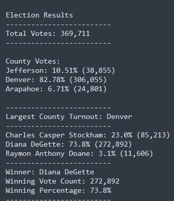

# Election Analysis

## Overview of Election Audit
Using a Python script and data provided for the below three counties, an analysis was completed by counting the votes submitted for three candidates. The .csv file is in the /Resources folder and the completed script results are located in the /Analysis directory. 

The voting data represent the election for U.S. House Colorado District 1 held on 11/06/2018. 

**Counties:** 
 - Jefferson
 - Denver
 - Arapahoe

**Candidates:**
 - Charles Casper Stockham
 - Diana DeGette
 - Raymon Anthony Doane

## Election Audit Results
Using the data provided the largest county which had the highest voter turnout was Denver. The winner of the specific election was the incumbent Diana DeGette with 73% (272,892) of the votes cast. 
 

## Election Audit Summary
